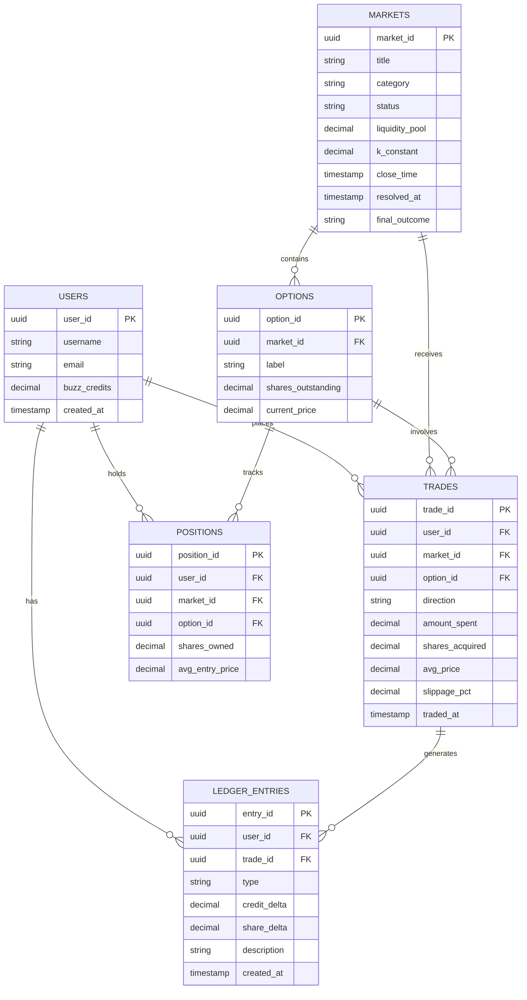

```mermaid
erDiagram
    USERS {
        uuid user_id PK
        string username
        string email
        decimal buzz_credits
        timestamp created_at
    }

    MARKETS {
        uuid market_id PK
        string title
        string category
        string status
        decimal liquidity_pool
        decimal k_constant
        timestamp close_time
        timestamp resolved_at
        string final_outcome
    }

    OPTIONS {
        uuid option_id PK
        uuid market_id FK
        string label
        decimal shares_outstanding
        decimal current_price
    }

    TRADES {
        uuid trade_id PK
        uuid user_id FK
        uuid market_id FK
        uuid option_id FK
        string direction
        decimal amount_spent
        decimal shares_acquired
        decimal avg_price
        decimal slippage_pct
        timestamp traded_at
    }

    LEDGER_ENTRIES {
        uuid entry_id PK
        uuid user_id FK
        uuid trade_id FK
        string type
        decimal credit_delta
        decimal share_delta
        string description
        timestamp created_at
    }

    POSITIONS {
        uuid position_id PK
        uuid user_id FK
        uuid market_id FK
        uuid option_id FK
        decimal shares_owned
        decimal avg_entry_price
    }

    USERS ||--o{ TRADES : "places"
    USERS ||--o{ LEDGER_ENTRIES : "has"
    USERS ||--o{ POSITIONS : "holds"
    MARKETS ||--o{ OPTIONS : "contains"
    MARKETS ||--o{ TRADES : "receives"
    OPTIONS ||--o{ TRADES : "involves"
    OPTIONS ||--o{ POSITIONS : "tracks"
    TRADES ||--o{ LEDGER_ENTRIES : "generates"
```