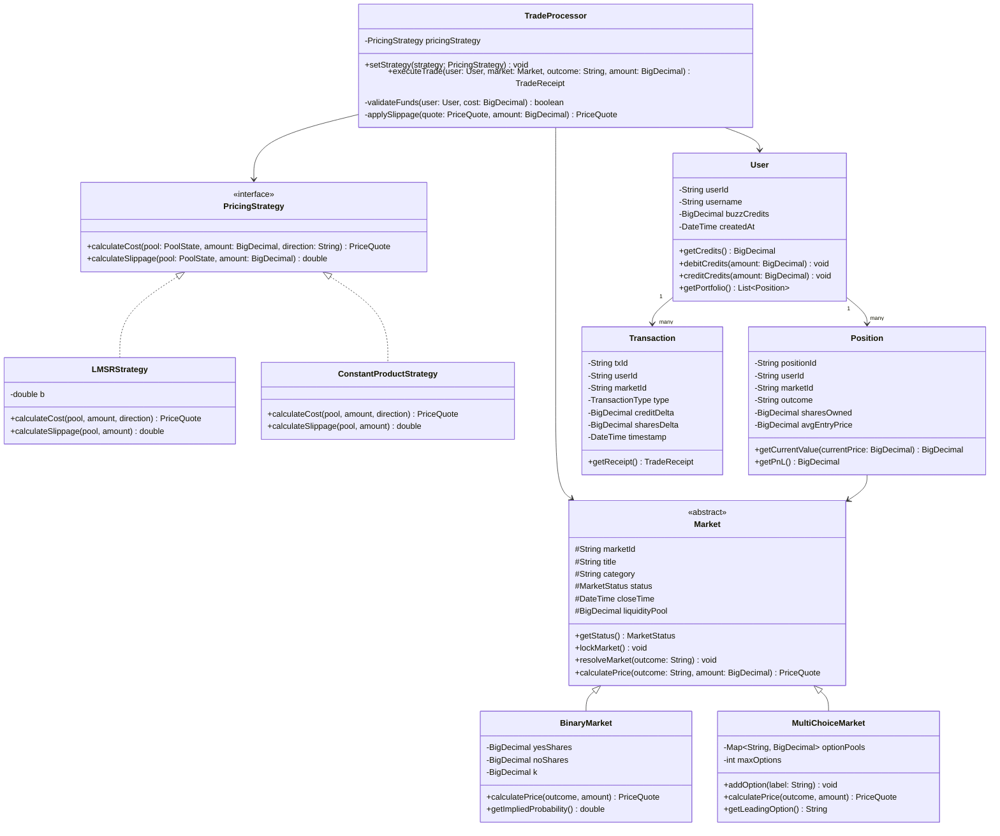

```mermaid
classDiagram
    class Market {
        <<abstract>>
        #String marketId
        #String title
        #String category
        #MarketStatus status
        #DateTime closeTime
        #BigDecimal liquidityPool
        +getStatus() MarketStatus
        +lockMarket() void
        +resolveMarket(outcome: String) void
        +calculatePrice(outcome: String, amount: BigDecimal) PriceQuote
    }

    class BinaryMarket {
        -BigDecimal yesShares
        -BigDecimal noShares
        -BigDecimal k
        +calculatePrice(outcome, amount) PriceQuote
        +getImpliedProbability() double
    }

    class MultiChoiceMarket {
        -Map~String, BigDecimal~ optionPools
        -int maxOptions
        +addOption(label: String) void
        +calculatePrice(outcome, amount) PriceQuote
        +getLeadingOption() String
    }

    class TradeProcessor {
        -PricingStrategy pricingStrategy
        +setStrategy(strategy: PricingStrategy) void
        +executeTrade(user: User, market: Market, outcome: String, amount: BigDecimal) TradeReceipt
        -validateFunds(user: User, cost: BigDecimal) boolean
        -applySlippage(quote: PriceQuote, amount: BigDecimal) PriceQuote
    }

    class PricingStrategy {
        <<interface>>
        +calculateCost(pool: PoolState, amount: BigDecimal, direction: String) PriceQuote
        +calculateSlippage(pool: PoolState, amount: BigDecimal) double
    }

    class LMSRStrategy {
        -double b
        +calculateCost(pool, amount, direction) PriceQuote
        +calculateSlippage(pool, amount) double
    }

    class ConstantProductStrategy {
        +calculateCost(pool, amount, direction) PriceQuote
        +calculateSlippage(pool, amount) double
    }

    class User {
        -String userId
        -String username
        -BigDecimal buzzCredits
        -DateTime createdAt
        +getCredits() BigDecimal
        +debitCredits(amount: BigDecimal) void
        +creditCredits(amount: BigDecimal) void
        +getPortfolio() List~Position~
    }

    class Position {
        -String positionId
        -String userId
        -String marketId
        -String outcome
        -BigDecimal sharesOwned
        -BigDecimal avgEntryPrice
        +getCurrentValue(currentPrice: BigDecimal) BigDecimal
        +getPnL() BigDecimal
    }

    class Transaction {
        -String txId
        -String userId
        -String marketId
        -TransactionType type
        -BigDecimal creditDelta
        -BigDecimal sharesDelta
        -DateTime timestamp
        +getReceipt() TradeReceipt
    }

    Market <|-- BinaryMarket
    Market <|-- MultiChoiceMarket
    PricingStrategy <|.. LMSRStrategy
    PricingStrategy <|.. ConstantProductStrategy
    TradeProcessor --> PricingStrategy
    TradeProcessor --> User
    TradeProcessor --> Market
    User "1" --> "many" Position
    User "1" --> "many" Transaction
    Position --> Market
```