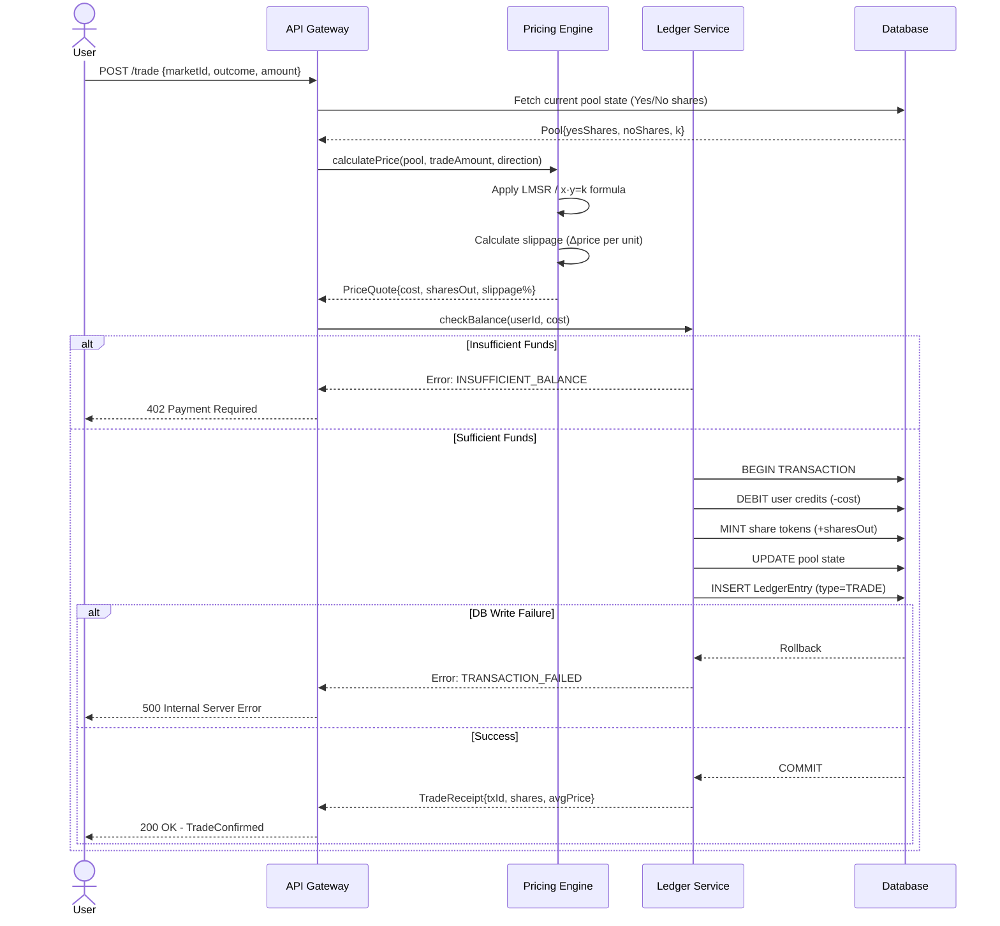

```mermaid
sequenceDiagram
    actor User
    participant GW as API Gateway
    participant PE as Pricing Engine
    participant LS as Ledger Service
    participant DB as Database

    User->>GW: POST /trade {marketId, outcome, amount}
    GW->>DB: Fetch current pool state (Yes/No shares)
    DB-->>GW: Pool{yesShares, noShares, k}

    GW->>PE: calculatePrice(pool, tradeAmount, direction)
    PE->>PE: Apply LMSR / x·y=k formula
    PE->>PE: Calculate slippage (Δprice per unit)
    PE-->>GW: PriceQuote{cost, sharesOut, slippage%}

    GW->>LS: checkBalance(userId, cost)

    alt Insufficient Funds
        LS-->>GW: Error: INSUFFICIENT_BALANCE
        GW-->>User: 402 Payment Required
    else Sufficient Funds
        LS->>DB: BEGIN TRANSACTION
        LS->>DB: DEBIT user credits (-cost)
        LS->>DB: MINT share tokens (+sharesOut)
        LS->>DB: UPDATE pool state
        LS->>DB: INSERT LedgerEntry (type=TRADE)

        alt DB Write Failure
            DB-->>LS: Rollback
            LS-->>GW: Error: TRANSACTION_FAILED
            GW-->>User: 500 Internal Server Error
        else Success
            DB-->>LS: COMMIT
            LS-->>GW: TradeReceipt{txId, shares, avgPrice}
            GW-->>User: 200 OK - TradeConfirmed
        end
    end
```