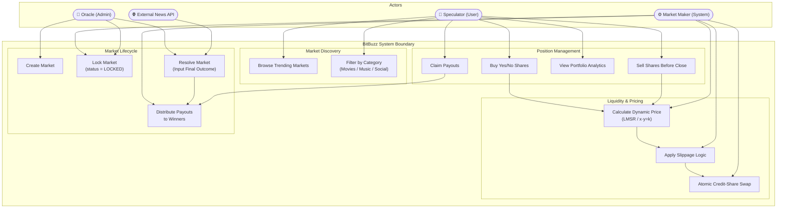

```mermaid
graph TB
    subgraph Actors
        U(["👤 Speculator (User)"])
        A(["🔑 Oracle (Admin)"])
        AMM(["⚙️ Market Maker (System)"])
        API(["🌐 External News API"])
    end

    subgraph BitBuzz System Boundary
        subgraph Market Discovery
            UC1["Browse Trending Markets"]
            UC2["Filter by Category\n(Movies / Music / Social)"]
        end

        subgraph Position Management
            UC3["Buy Yes/No Shares"]
            UC4["Sell Shares Before Close"]
            UC5["View Portfolio Analytics"]
            UC6["Claim Payouts"]
        end

        subgraph Liquidity & Pricing
            UC7["Calculate Dynamic Price\n(LMSR / x·y=k)"]
            UC8["Apply Slippage Logic"]
            UC9["Atomic Credit-Share Swap"]
        end

        subgraph Market Lifecycle
            UC10["Create Market"]
            UC11["Lock Market\n(status = LOCKED)"]
            UC12["Resolve Market\n(Input Final Outcome)"]
            UC13["Distribute Payouts\nto Winners"]
        end
    end

    U --> UC1
    U --> UC2
    U --> UC3
    U --> UC4
    U --> UC5
    U --> UC6

    UC3 --> UC7
    UC4 --> UC7
    UC7 --> UC8
    UC8 --> UC9

    AMM --> UC7
    AMM --> UC8
    AMM --> UC9
    AMM --> UC11
    AMM --> UC13

    A --> UC10
    A --> UC12
    A --> UC11

    API --> UC12

    UC12 --> UC13
    UC6 --> UC13
```